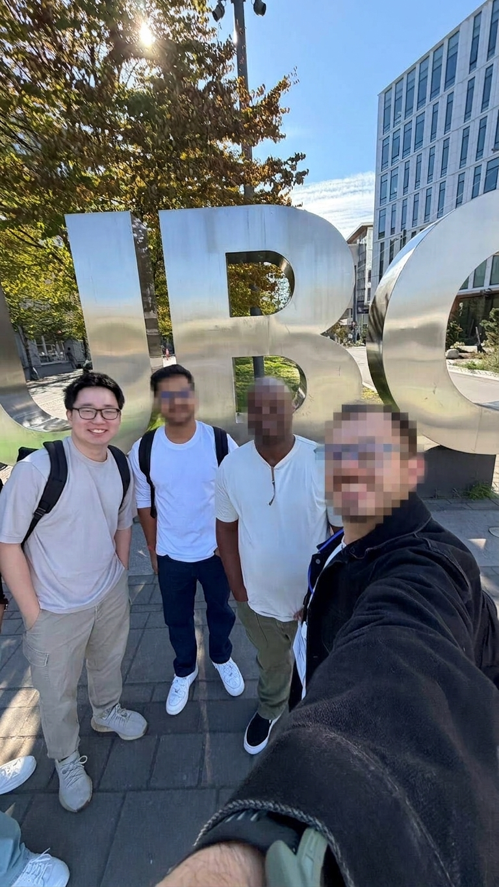

Orientation week kicked off with meeting the rest of my cohort, starting with the people at my orientation table. After the formal sessions wrapped up, a few of us grabbed ice cream nearby, which turned out to be a great way to start putting names to faces before classes even began.

The first week of actual classes was a lot to take in. Between new course content and figuring out how everything gets submitted, I felt a bit overwhelmed at times. That said, I managed to get through all my assignments for the week, which felt like a solid first win.

Heading into the next week, I'm shifting focus toward prepping for upcoming quizzes. It's a good reminder that MDS moves fast, so staying a little ahead rather than catching up after the fact will probably be the theme for the rest of the term.

